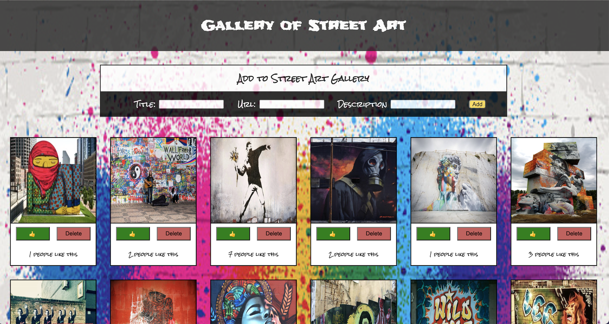
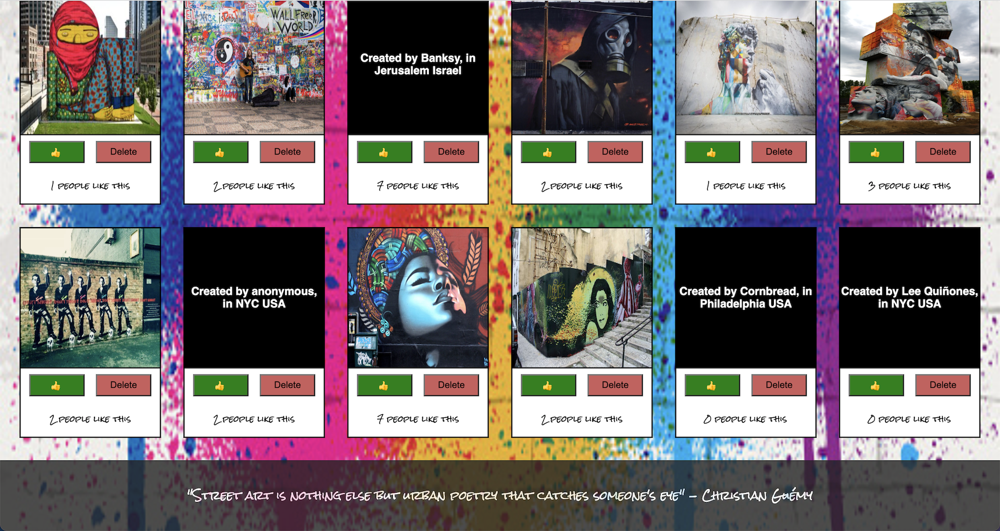

# Project Name
Street art is everywhere and can be super inspiring. This API you can browse through some street art images.  Add more images with descriptions to build an even larger library to browse.  Clicking on a picture will switch to details about that image.  Also don't forget to show our urban artist some love by clicking on the like button! There is an option to delete if you really want.  

Here we want to celebrate and admire street art around the world! 

[Project Instructions](./INSTRUCTIONS.md)

## Description
This API is linked to a postico database. It uses axios to communicate with the server side and pg to communicate with the database. Data is stored in Apps.jsx using React useState.  All server communication is done in App.jsx and information is passed down with props. Swapping the images to text uses a ternary conditional. Each image has a like option that will increase likes by increments of one.  Number of total likes are displayed below each image. There is also a delete option that will delete it from the database.  All styling is done with css.

Additional README details can be found [here](https://github.com/PrimeAcademy/readme-template/blob/master/README.md).
