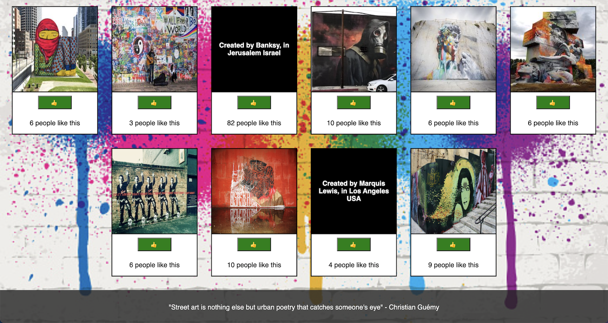

# Project Name
Street art is everywhere and can be super inspiring. This API you can browse through some street art images.  Clicking on a picture will switch to details about that image.  Also don't forget to show our urban artist some love by clicking on the like button! Here we want to celebrate and admire street art around the world! 

[Project Instructions](./INSTRUCTIONS.md)

## Description

Additional README details can be found [here](https://github.com/PrimeAcademy/readme-template/blob/master/README.md).
